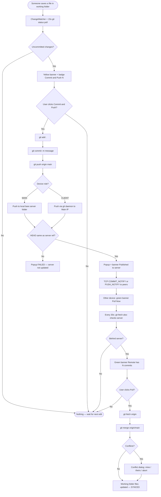
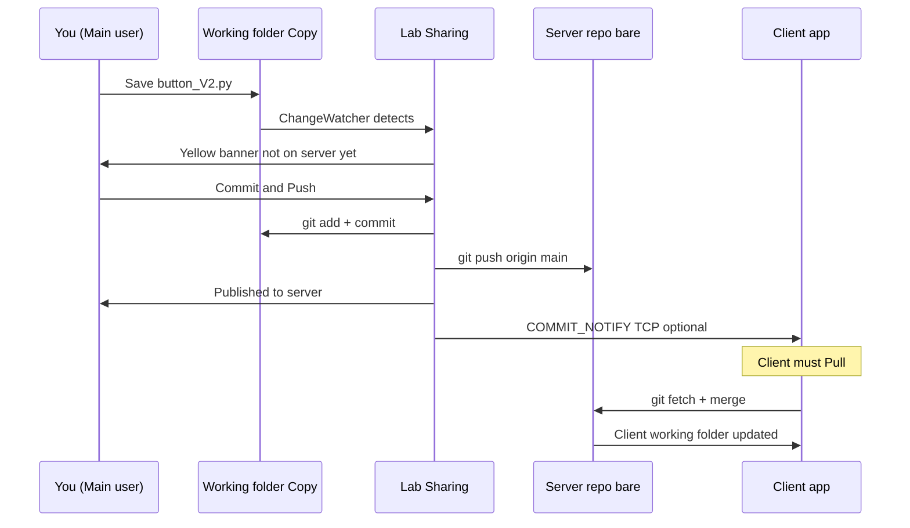
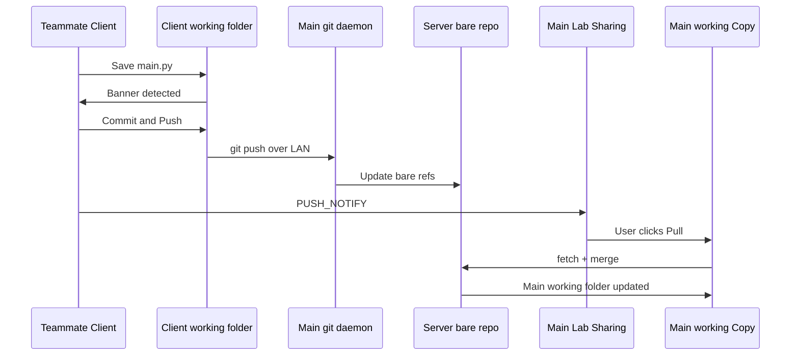
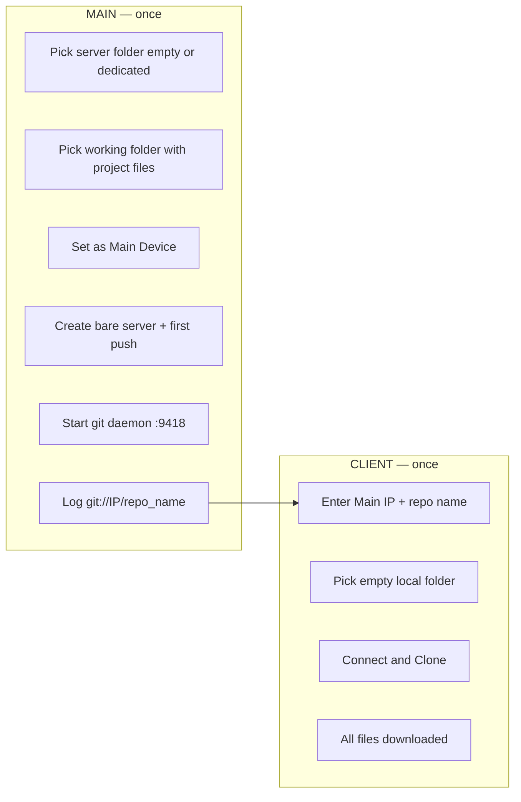
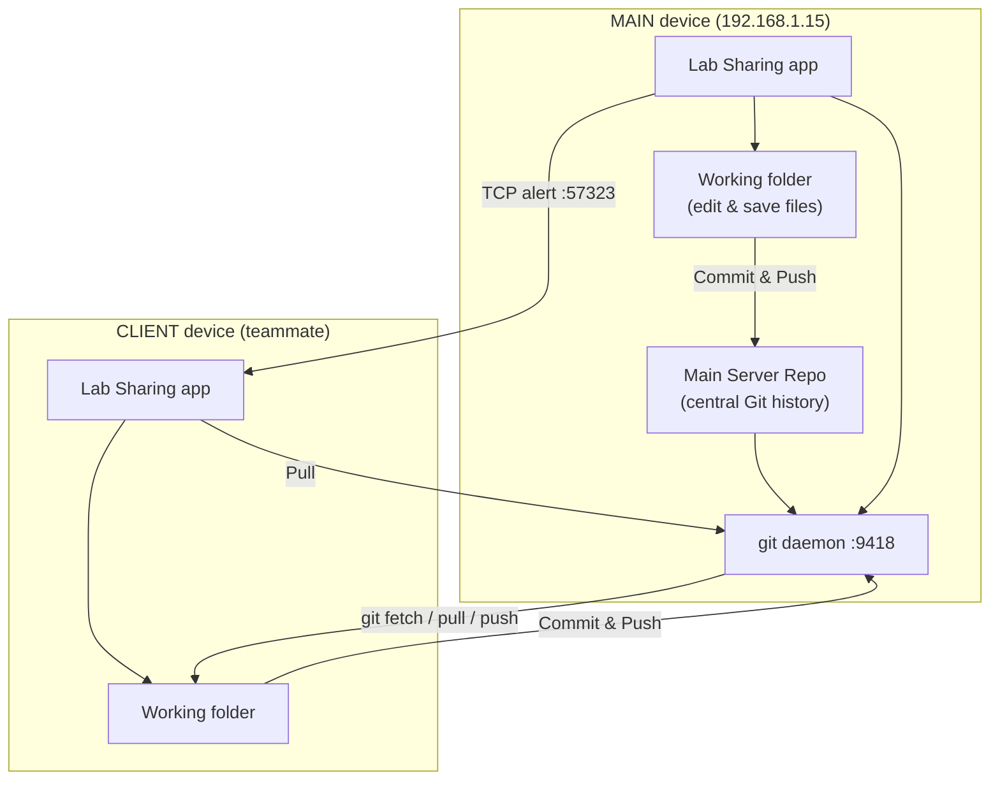

# Lab Sharing — Git Sync Plan & Workflow

**Version:** 1.1  
**Date:** 2026-07-29  
**Status:** Phases 1–6 implemented — Phase 5 field testing in progress  
**Purpose:** Replace GitHub for a small lab team by syncing a shared project over **LAN only** (no internet, more control, more security).

---

## 1. The idea (in plain language)

Your team works on **one same project**. Instead of pushing to GitHub:

1. **One computer is MAIN (server)** — it holds the **central copy of history** (like a private GitHub repo on your network).
2. **Every computer (Main + Clients) has a working folder** — where you actually edit code (like your project open in VS Code / Cursor).
3. When someone **commits and pushes**, changes go to the **Main Server Repo**.
4. Other devices get a **notification** → they **pull** → their working folder becomes up to date.

**Security note:** Data stays on your LAN. No cloud. You control who is on the network and who runs the Main device.

---

## 2. GitHub analogy (your mental model)

| GitHub | Lab Sharing |
|--------|-------------|
| GitHub empty repository | Main Server Repo (first setup — then first push fills it) |
| `git push` uploads commits | **Commit & Push** on Main or Client |
| GitHub shows files in the browser | Server stores **all file versions in Git history** (see §4) |
| Teammate `git clone` / `git pull` | Client **Connect & Clone** / **Pull** |
| GitHub notification / you check repo | App **banner + optional desktop alert** → **Pull Now** |

### First time (like creating GitHub repo + first push)

```text
1. Create empty central repo (Main Server Repo)
2. Working folder has your project files
3. First push copies ALL project history into the central repo
4. Branch: main (or master)
```

### Every day after that (like normal GitHub)

```text
1. Edit files in working folder
2. App detects changes (like VS Code green "Modified")
3. You commit + push → only new/changed commits go to server
4. Other devices pull → get only what changed
```

---

## 3. Required folder structure

### MAIN device (e.g. your laptop `192.168.1.15`)

```text
Desktop\
│
├── UI_sampel-main              ← MAIN SERVER REPO (central — like GitHub)
│   └── (Git storage: objects, refs, HEAD)
│       Clients connect: git://192.168.1.15/UI_sampel-main
│
├── UI_sampel-main - Copy       ← WORKING FOLDER (where you EDIT files)
│   ├── buttons\button_V2.py
│   ├── main.py
│   └── .git  → origin points to server repo above
│
└── (optional backup folders from repair — ignore)
    UI_sampel-main.__lab_old_nonbare__
```

**Important rules on MAIN:**

| Folder | You edit files here? | Role |
|--------|----------------------|------|
| **Working folder** (`… - Copy`) | **YES** | Your daily project (like local clone) |
| **Server repo** (`UI_sampel-main`) | **NO** | Central history store (like GitHub backend) |
| **Backup `.__lab_old_*`** | NO | Old copy — safe to delete later |

> **Why server folder does not look like a normal project folder**  
> GitHub also stores data as Git objects, not as a simple folder of `.py` files on disk.  
> Your **files are inside Git history**. You see them in the working folder (Main) or after **Pull** (Client).  
> **Planned improvement (Phase 6):** optional **Server Mirror** folder with visible files after each push — see §11.

### CLIENT device (teammate PC)

```text
C:\Projects\my_project\     ← WORKING FOLDER only
├── buttons\button_V2.py
├── main.py
└── .git  → origin = git://MAIN_IP/UI_sampel-main
```

Client does **not** need a separate server folder — only Main has the central repo.

---

## 4. Complete end-to-end workflows (when someone edits the working folder)

**File location:** this section is the master flowchart + step-by-step for Main and Client changes.  
**Also see:** §5 setup, §6 daily summary, §7 background detection.

### 4.1 Master picture — three places data lives

```text
┌─────────────────────┐     ┌─────────────────────┐     ┌─────────────────────┐
│  MAIN working       │     │  MAIN server repo   │     │  CLIENT working     │
│  folder             │     │  (central / GitHub) │     │  folder             │
│  (edit on Main PC)  │     │  on Main PC only    │     │  (edit on Client PC)│
└──────────┬──────────┘     └──────────▲──────────┘     └──────────┬──────────┘
           │                           │                           │
           │    push (Commit & Push)    │    push                     │
           └──────────────────────────►│◄────────────────────────────┘
                                       │
                           fetch / pull (Pull button)
                                       │
           ┌───────────────────────────┴───────────────────────────┐
           │  All devices read/write history via Main server repo   │
           │  exposed as: git://MAIN_IP/UI_sampel-main (:9418)      │
           └─────────────────────────────────────────────────────────┘
```

### 4.2 System flowchart (all cases)



---

### 4.3 CASE A — MAIN device edits working folder (full steps)

**Example:** You edit `button_V2.py` in `UI_sampel-main - Copy`.

| Step | Who / what | What happens | Folder state |
|------|------------|--------------|--------------|
| **A1** | You | Save file in **working folder** | Copy: file changed on disk |
| **A2** | `ChangeWatcher` | Detects change (~2s debounce or 15s poll) | — |
| **A3** | App UI | Yellow banner: *"N file(s) changed — not on server yet"* | Server **NOT** updated yet |
| **A4** | App UI | Button shows **Commit & Push (N)** | — |
| **A5** | You | Type message, click **Commit & Push** | — |
| **A6** | Git | `git add .` → stages changes in **working** `.git` | Copy: staged |
| **A7** | Git | `git commit -m "..."` → new commit in working repo | Copy: commit `abc123` |
| **A8** | Git | `git push origin main` → **local path** to server bare repo | Server repo: receives commit |
| **A9** | App | `verify_published` — compares Copy HEAD vs server ref | Must match |
| **A10** | App | Green banner + popup: **Published to server @ abc123** | **Server is up to date** |
| **A11** | App | Sends **COMMIT_NOTIFY** to Client IPs (if in device list) | Client gets hint only |
| **A12** | Client (later) | Must **Pull** to get files — not automatic | Client still old until Pull |

**Git commands on MAIN (behind the scenes):**

```bash
cd "UI_sampel-main - Copy"
git add .
git commit -m "your message"
git push origin main          # → C:\...\UI_sampel-main (bare server)
```

**What does NOT happen automatically:**

- Server repo does not "fetch" from working folder by itself — **you push**.
- Client folders do not update until **they pull**.



---

### 4.4 CASE B — CLIENT device edits working folder (full steps)

**Example:** Teammate edits `main.py` on Client PC.

| Step | Who / what | What happens | Folder state |
|------|------------|--------------|--------------|
| **B1** | Teammate | Save file in **Client working folder** | Client: file changed |
| **B2** | `ChangeWatcher` | Same detection as Main | Yellow banner |
| **B3** | Teammate | **Commit & Push** | — |
| **B4** | Git | commit in Client working `.git` | Client: new commit |
| **B5** | Git | `git push origin main` → `git://192.168.1.15/UI_sampel-main` | **Server repo** updated |
| **B6** | Main `git daemon` | Receives push into bare repo (`receive-pack`) | Server has new commit |
| **B7** | App | **Published to server** on Client | Server up to date |
| **B8** | App | **PUSH_NOTIFY** sent to Main IP | Main gets banner |
| **B9** | Main user | Sees *"hostname pushed: message"* → **Pull** | — |
| **B10** | Git on Main | `fetch` + `merge` into **Main working folder** | Main Copy folder updated |

**Git commands on CLIENT:**

```bash
cd "Client_working_folder"
git add .
git commit -m "teammate change"
git push origin main          # → git://MAIN_IP/UI_sampel-main
```



---

### 4.5 CASE C — No edit: another device already pushed (you only Pull)

| Step | What happens |
|------|--------------|
| C1 | Teammate (or you on other PC) already pushed to server |
| C2 | Your app: every **30s** runs `git fetch origin` |
| C3 | Finds commits you don't have → green banner **"Remote has N new commits"** |
| C4 | Or TCP message → **"Main updated" / "X pushed"** |
| C5 | You click **Pull** |
| C6 | `git fetch` + `git merge origin/main` |
| C7 | **Working folder files update** — you are synced |

---

### 4.6 What each folder contains after each action

| Action | Main working (Copy) | Main server repo | Client working |
|--------|---------------------|------------------|----------------|
| After edit only | Changed files, **not committed** | Unchanged | — |
| After Commit only | Committed locally | Unchanged | — |
| After Commit & Push | Clean, has latest commit | **Has latest commit** | Unchanged until Pull |
| After Client Pull | — | Unchanged | **Files match server** |
| After Main Pull (client pushed) | **Files match server** | Has latest commit | Has latest commit |

---

### 4.7 First-time setup flow (before any daily edits)



---

## 5. Architecture diagram



---

## 6. One-time setup workflow

### MAIN device

| Step | User action | What the app does |
|------|-------------|-------------------|
| 1 | Open **Git Sync** tab | — |
| 2 | **Server repo folder** → empty or dedicated folder (e.g. `UI_sampel-main`) | Will become **bare** central repo |
| 3 | **Working folder** → where project files live (e.g. `UI_sampel-main - Copy`) | Links to server, first push fills history |
| 4 | Click **Set as Main Device** | `git init` (if needed), create bare server, push all, start `git daemon` |
| 5 | Read Live Log | `Clients connect to: git://YOUR_IP/UI_sampel-main` — **share repo name with team** |

**Windows firewall (Main):** allow TCP **9418**, UDP **57322**, TCP **57323** on private network.

### CLIENT device

| Step | User action | What the app does |
|------|-------------|-------------------|
| 1 | Enter **Main IP** (e.g. `192.168.1.15`) | — |
| 2 | Enter **Repo name** from Main log (e.g. `UI_sampel-main`) | — |
| 3 | Choose **empty local folder** | — |
| 4 | Click **Connect & Clone** | `git clone git://MAIN_IP/repo_name` → all files downloaded |

---

## 7. Daily workflow

### A) MAIN user edits and shares

```text
┌─────────────────────────────────────────────────────────────┐
│ 1. Edit & save files in WORKING FOLDER                      │
│ 2. App detects change (banner + badge "Commit & Push (N)")  │
│ 3. Enter commit message                                     │
│ 4. Click Commit & Push                                      │
│    → git add . → git commit → git push → Main Server Repo   │
│ 5. Popup: "Published to server @ <hash>"                    │
│ 6. App alerts clients (if visible on LAN device list)       │
└─────────────────────────────────────────────────────────────┘
```

### B) CLIENT user gets updates

```text
┌─────────────────────────────────────────────────────────────┐
│ 1. Banner: "Main updated" or "Remote has N new commits"     │
│ 2. Click Pull Now (or Pull button)                          │
│    → git fetch → git merge                                  │
│ 3. Working folder files updated                             │
└─────────────────────────────────────────────────────────────┘
```

### C) CLIENT user edits and sends back

```text
Edit → Commit & Push → Main Server Repo → Main user Pull → in sync
```

---

## 8. Smart detection (background)

| Check | Interval | When changes found | Meaning |
|-------|----------|-------------------|---------|
| **Local** `git status` | ~15s (OneDrive/Windows) + file watcher | Yellow banner, button badge `(N)` | You have uncommitted edits — **not on server yet** |
| **Remote** `git fetch` | 30s | Green banner "Pull Now" | Server has new commits — **pull to update files** |
| **TCP message** | On push | Green banner + desktop toast | Faster hint from teammate (optional accelerator) |

**Detection ≠ synced.** Only **Commit & Push** (publish) or **Pull** (receive) moves code.

---

## 9. Sync states (team language)

Use these words in meetings:

| State | Meaning |
|-------|---------|
| **Detected** | File changed locally; not committed |
| **Committed** | Snapshot saved in local `.git` |
| **Published** | Pushed to Main Server Repo (`Published to server @ hash`) |
| **Alerted** | Other device got TCP/banner message |
| **Synced** | Pulled; working folder matches server history |

**Goal:** Main knows **Published**; Client confirms **Synced** (Phase 4 — pull acknowledgment).

---

## 10. What is implemented today (2026-07-29)

| Feature | Status |
|---------|--------|
| Main: working + bare server folders | ✅ Done |
| Client: clone / pull / push over LAN | ✅ Done |
| `git daemon` on Main | ✅ Done |
| Auto-convert wrong server folder → bare | ✅ Done |
| Local change detection + banner + badge | ✅ Done |
| Publish verify (`Published to server @ hash`) | ✅ Done |
| Push failure hints (non-bare server, etc.) | ✅ Done |
| Windows 11 support | ✅ Done (see `docs/WINDOWS.md`) |
| Fetch failure banner | ✅ Done |
| No auto-commit without user click | ✅ Done |
| Client "got the update" ack on Main | ✅ Phase 4 — PULL_ACK + sync status line |
| Server folder shows visible `.py` files (mirror) | ✅ Phase 6 — `UI_sampel-main_files` after push |
| Separate Send / Receive sync buttons (📤/📥) | ✅ Done |
| Auto-pull setting (Off / On) | ✅ Done |
| `default_branch` in config | ✅ Done |

---

## 11. Implementation roadmap (for approval)

### Phase 1 — Server path & bare repo ✅ COMPLETE

- [x] Daemon uses saved `server_repo_path` after restart  
- [x] Auto-repair non-bare server folder  
- [x] Verify push: working `HEAD` == server ref  

### Phase 2 — Honest notifications ✅ COMPLETE

- [x] Local banner: "not on server yet"  
- [x] Popups on success/fail  
- [x] No silent fetch errors  
- [x] VS Code–style file list in UI  

### Phase 3 — UX polish ✅ COMPLETE

- [x] Buttons: **📤 Send** / **📥 Receive**
- [x] Auto-pull Off / On in Git Sync tab
- [x] In-app note: edit working folder + mirror path on Main

### Phase 4 — "Did teammate get it?" ✅ COMPLETE

- [x] Client sends **PULL_ACK** after successful Receive
- [x] Main shows sync status line per client
- [x] "Alert delivered" vs client synced messaging

### Phase 5 — Lab hardening

- [x] Safer daemon stop (PID only)
- [x] Branch name stored in config (`main` vs `master`)
- [x] Conflict wizard tested on 2 machines
- [x] Ubuntu Main + Windows Client test matrix

### Phase 6 — Server mirror folder ✅ COMPLETE

After each **Send** on Main, files are exported to:

```text
<server_bare_path>_files
```

Example: `UI_sampel-main_files` — open in Explorer to browse project like GitHub.

---

## 12. Test checklist (sign-off)

Run on **two machines** before lab deployment:

### Setup
- [x] Main: Set as Main Device — Live Log shows `git://IP/repo_name`  
- [x] Client: Clone into empty folder — files match Main working folder  

### Main → Client
- [x] Main: edit in **working folder** → banner appears  
- [x] Main: Commit & Push → **Published to server**  
- [x] Client: Pull → file content matches Main  

### Client → Main
- [x] Client: edit → Commit & Push  
- [x] Main: Pull → file content matches Client  

### Reliability
- [x] Restart Main app — daemon + paths unchanged  
- [x] Push never targets non-bare server (or auto-repairs)  

---

## 13. Team approval checklist

Please each sign or comment:

| # | Question | Approve? |
|---|----------|----------|
| 1 | One MAIN device holds central repo; others are CLIENTs | ☑ Yes ☐ No |
| 2 | Edit only in **working folder**; server repo is central store | ☑ Yes ☐ No |
| 3 | Flow: detect → user commits → push → others pull | ☑ Yes ☐ No |
| 4 | No GitHub / no internet required for sync | ☑ Yes ☐ No |
| 5 | Phase 6: add **visible server mirror folder** (Option A)? | ☑ Yes ☐ No ☐ Later |
| 6 | Phase 4: Main shows if client **actually pulled**? | ☑ Yes ☐ No |

**Approved by:** _______________  **Date:** _______________

---

## 14. Quick reference (your current Windows setup)

| Item | Value |
|------|--------|
| Main IP | `192.168.1.15` |
| Client URL | `git://192.168.1.15/UI_sampel-main` |
| Repo name (for clients) | `UI_sampel-main` |
| Working folder (edit here) | `C:\Users\swtle\OneDrive\Desktop\UI_sampel-main - Copy` |
| Server repo (central) | `C:\Users\swtle\OneDrive\Desktop\UI_sampel-main` |
| Backup (ignore) | `UI_sampel-main.__lab_old_nonbare__` |

---

## 15. Related files

- `docs/WINDOWS.md` — run on Windows 11  
- `core/git_manager.py` — Git operations  
- `gui/git_panel.py` — Git Sync UI  
- `core/change_watcher.py` — local file detection  

---

*End of plan — update this file when phases complete or team decisions change.*
